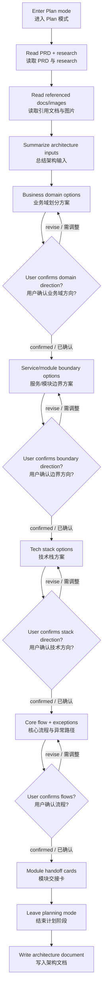

# Architecture Design / 架构设计

将 PRD 转化为架构设计文档，但不能把这件事当成一次性文档生成任务。先分析上下文，再分块确认关键架构决策，最后再落文档。

这个 skill 还是后续 `technical-design` 的上游输入定义者。除了完成架构判断，还必须产出稳定、可消费的模块交接信息，避免技术设计阶段重新猜测模块边界。

<HARD-GATE>
Do NOT write the full architecture document immediately after reading the PRD.

You MUST:
1. enter Plan mode first
2. read the PRD, research, referenced docs, and referenced images
3. confirm each major architecture decision with the user in stages
4. write the document only after the staged confirmations are complete
</HARD-GATE>

## Scope / 使用范围

**Use this skill when**:
- 用户要求基于 PRD 产出架构设计文档
- 需要从 PRD 和 research 中提取架构约束、候选方案、关键决策
- 需要进行业务域划分、模块设计或微服务聚合设计

**Do NOT use this skill for**:
- 详细 API 设计
- 数据库表结构设计
- 详细部署运维方案
- 跳过确认、直接生成完整架构文档

如果用户请求的是上面这些更细的设计内容，应先完成架构设计，再交给后续 skill 处理。

## Architecture Boundary / 架构边界

这个 skill 的目标是定义系统边界，不是提前写技术设计。

术语统一如下：
- `domain`：业务能力边界，用于表达业务职责怎么分
- `service`：实现载体，用于表达系统怎么部署或聚合运行
- `module`：技术设计消费边界，也是后续 `docs/03-technical-design/{module_id}/...` 的最小单元
- `work item`：交付拆分单元，用于表达后续设计和实现的分批方式，不等于技术设计目录单元
- `module_id`：技术设计消费的唯一模块标识，必须使用 kebab-case 英文 slug，并作为 `docs/03-technical-design/{module_id}/...` 的目录名

交接语义必须稳定：
- 后续 `technical-design` 的最小消费单元始终是 `module_id`
- `work item` 只用于排期和交付分组，不用于替代 `module_id`
- 如果一个 `work item` 覆盖多个模块，必须在架构文档里显式拆成多个 `module_id`
- `service` 可以承载多个 `module`，但 `technical-design` 不应按 `service` 重新定义边界

架构设计负责回答的问题：
- 系统有哪些业务域、模块或服务
- 每个边界分别拥有什么职责、数据和依赖
- 模块之间如何协作
- 哪些技术路线适合当前约束
- 哪些核心流程、异常路径和非功能约束会影响整体设计

架构设计不负责回答的问题：
- 某个接口的详细 path、request、response
- 某张表的字段、类型、索引
- 某个前端页面的组件拆分和状态设计
- 某段业务逻辑的实现级伪代码

如果必须提到 API 或数据设计，只能停留在原则级，例如：
- 可以写：`订单服务通过同步接口供支付服务发起扣款`
- 可以写：`用户域拥有用户主数据，权限域只缓存授权投影`
- 不要写：`POST /api/v1/orders/create`
- 不要写：`orders(id bigint, status varchar(32), ...)`

更推荐的文档骨架见 [references/architecture-template.md](references/architecture-template.md)，禁止下沉的内容清单见 [references/out-of-scope.md](references/out-of-scope.md)。

## Why This Must Be Interactive / 为什么必须交互式推进

架构设计是决策密集型工作，不是信息搬运。

```
架构设计错误的代价 >> 多花几分钟确认的成本
```

PRD 提供的是业务目标，不会自动给出正确的服务边界、模块职责、技术选型和异常路径。即使需求看起来明确，也必须通过分块确认来暴露假设和权衡。

## Checklist / 执行清单

You MUST create a task for each item and complete them in order:

1. **Enter Plan mode** - architecture work must be planned, not streamed out in one pass
2. **Read source context** - read `docs/01-prd/PRD.md` and `docs/01-prd/research.md`
3. **Expand referenced material** - scan both files for image references and markdown/doc references, then read them
4. **Summarize architecture inputs** - list the referenced files/images and explain how each influences the design
5. **Identify business domains** - propose 2-3 partitioning options, explain trade-offs, confirm with user
6. **Design service/module boundaries** - propose aggregation options, compare coarse vs fine granularity, confirm with user
7. **Narrow technical choices** - extract candidate stacks from research, compare 2-3 options, confirm with user
8. **Design core flows** - capture main business flows and exception paths, confirm with user
9. **Produce module handoff cards** - define the module-level handoff contract that `technical-design` will consume
10. **Write architecture document** - leave planning mode and write `docs/02-architecture/architecture-design.md`
11. **Handle updates explicitly** - if the file already exists, update incrementally with versioning and change markers

## Process Flow / 处理流程



## The Process / 详细流程

### 1. Enter Plan Mode First

必须先进入 Plan 模式，再开始任何架构推演或问题确认。

Do not:
- 直接输出完整架构文档
- 在普通对话流里一次问完所有问题
- 在尚未确认关键决策前落盘

### 2. Read the Full Input Surface

必须读取：
- `docs/01-prd/PRD.md`
- `docs/01-prd/research.md`
- 两个文件中引用的图片
- 两个文件中引用的 markdown 或其他文档

读取后要显式输出：
- 引用文档清单
- 图片清单
- 每个引用项为什么影响架构判断

不要把图片或引用文档当成“可选补充材料”。如果被引用，它们就是输入的一部分。

### 3. Confirm Decisions in Stages

像 `brainstorming` 一样分阶段推进，不要把所有决策揉成一轮问答。

每个阶段都要：
- 先给出你基于当前材料的判断
- 提供 2-3 个可选方向
- 解释 trade-off
- 给出推荐方案与原因
- 用自然协作语言向用户确认后再进入下一阶段，不要依赖特定平台动作名

优先确认以下四类关键决策。

### 4. Business Domains

识别系统的业务域，并提供 2-3 种划分方式，例如：
- 更贴近业务能力的划分
- 更贴近团队协作边界的划分
- 更贴近未来演进的划分

必须说明：
- 每种方案的职责边界
- 哪些领域适合拆开，哪些应该保持一起
- 哪些划分会导致高耦合或高协调成本

如果 PRD 范围明显过大，先帮助用户拆成多个子项目或阶段，再继续当前 skill 的架构设计。

### 5. Service or Module Boundaries

在确认业务域后，再讨论微服务或模块边界。

必须提供对比：
- 聚合式方案：一个服务承载多个强相关业务域
- 细粒度方案：每个域独立服务或模块
- 折中方案：核心域独立，支撑域聚合

至少从这些维度分析：
- 性能与调用链复杂度
- 数据一致性与事务边界
- 团队协作成本
- 发布复杂度
- 演进弹性

推荐默认方向时，避免“为了看起来高级而过度拆分”。

### 6. Technology Choices

从 `research.md` 提取候选技术，不要凭空发散。

必须：
- 给出 2-3 个现实可行的选项
- 说明适用场景
- 说明团队能力前提和迁移成本
- 如果 research 已经明显收敛，也要解释为什么收敛

技术栈讨论聚焦架构层面，例如：
- 后端服务技术路线
- 通信方式
- 网关/鉴权框架
- 异步处理或事件机制

不要下沉到详细 API 或表结构。

### 7. Core Flows and Failure Paths

识别最关键的业务流程，并输出 Mermaid 图。

必须覆盖：
- 主成功路径
- 关键异常路径
- 跨服务或跨模块的交互点
- 需要幂等、补偿、重试或降级的地方

如果存在多个核心流程，优先覆盖对架构影响最大的那几个，而不是试图穷举全部流程。

### 8. Module Handoff Cards

在写架构文档前，必须先为每个后续技术设计单元产出模块交接卡。

每张交接卡至少包含：
- `module_id`
- `module_name`
- `goal`
- `owner_domain`
- `delivery_scope`: `backend` / `frontend` / `both`
- `frontend_surfaces`
- `ui_ownership_notes`
- `upstream_dependencies`
- `downstream_dependencies`
- `input_contracts`
- `output_contracts`
- `data_owner`
- `delivery_priority`
- `open_questions`

要求：
- `module_id` 必须唯一，使用 kebab-case 英文 slug
- `module_id`、依赖列表、交付范围必须可直接被 `technical-design` 消费
- `input_contracts` / `output_contracts` 只写边界与职责，不下沉到字段级 schema

依赖契约的最低粒度必须足够支撑后续技术设计，至少说明：
- 调用或事件方向
- 同步 / 异步
- 发起方与拥有方
- 契约目的和边界职责
- 交付前置关系
- 失败处理责任归属

前端相关模块还必须说明：
- 哪些页面、用户旅程或交互面属于该 `module_id`
- 哪些跨模块协作会直接影响前端交互设计
- 如果前端归属不明确，要在交接卡中显式标注 open question，而不是留给 `technical-design` 猜测

### 9. Write the Document Only After Confirmation

完成所有关键决策确认后：
1. 结束计划阶段，进入写作阶段
2. 生成 `docs/02-architecture/architecture-design.md`
3. 明确告知用户已完成写入

写作时优先参考 [references/architecture-template.md](references/architecture-template.md) 的推荐骨架，但不要机械套模板。章节可以合并、重排或省略，只要仍然保持架构层边界清晰。

## Document Requirements / 文档要求

### YAML Frontmatter

```yaml
---
version: 1.0.0
status: draft
modules:
  - module-name
change_log:
  - version: 1.0.0
    date: YYYY-MM-DD
    changes: 初始版本
---
```

### Required Structure / 必备结构

文档至少应包含：
- 背景与目标
- 架构约束与输入依据
- 业务域划分
- 后端微服务划分或模块划分
- 核心技术选型与理由
- 核心业务流程与 Mermaid 图
- 依赖契约摘要
- 模块交接卡
- 异常处理与关键风险
- 工作项清单

如果需要提到数据或接口，只允许停留在以下粒度：
- 数据归属与一致性策略
- 接口或事件的交互方向与职责
- 模块之间的契约边界

不要写成技术设计文档。更具体的排除项见 [references/out-of-scope.md](references/out-of-scope.md)。

### Recommended Writing Shape / 推荐写法

为保证通用性，不使用硬编码模板，而使用“推荐骨架 + 可省略条件”的方式。

## Incremental Update Rules / 增量更新规则

如果目标文件已存在，不要整篇重写。

必须：
1. 读取旧版本
2. 对比 PRD、research、引用材料和当前文档的差异
3. 只更新受影响章节
4. 添加更新标记：`<!-- UPDATED: 2026-03-13 -->`
5. 如果是破坏性调整，添加：`<!-- BREAKING: 说明 -->`
6. 递增版本号并更新 `change_log`

## Collaboration Contract / 协作契约

`technical-design` 会默认消费本 skill 的以下产物：
- `modules` frontmatter
- 工作项清单
- 模块交接卡
- 依赖契约摘要

消费优先级必须明确：
- 模块交接卡和依赖契约摘要是 `technical-design` 的主输入
- PRD 和 research 在技术设计阶段主要用于校验和补充，不用于重新定义模块边界
- 如果架构文档里的 `module_id`、依赖关系或前端归属不清晰，应先回补架构文档，而不是在技术设计阶段自行重构边界

如果这些内容缺失，后续技术设计就会退化为重新做一轮边界澄清。因此这里不是“推荐填写”，而是必须稳定产出。

默认建议包含这些章节：
- 背景与目标
- 输入依据与约束
- 业务域划分
- 服务 / 模块边界
- 核心流程与异常流程
- 技术选型与理由
- 数据归属与存储策略
- 集成关系与外部依赖
- 风险、取舍与开放问题
- 工作项清单

如果某类内容对当前项目不重要，可以简写或省略，但不要用 API 设计或数据库表结构去填充文档长度。

### Module List Format

供后续 `technical-design` 解析的模块清单必须和模块交接卡保持一致，建议使用下面格式：

```markdown
## 后端微服务划分
- user-center-service: 用户中心服务，聚合用户域、权限域、组织域
- order-service: 订单服务，聚合订单域、支付域

## 工作项清单
- user-account: 用户账号模块，负责注册、登录、资料维护
- permission-center: 权限中心模块，负责角色、权限与授权查询
```

格式要求：
- 使用 `module_id: 描述`
- `module_id` 必须与模块交接卡中的 `module_id` 完全一致
- 工作项清单描述交付边界，模块交接卡描述消费契约

## Red Flags

出现以下任一情况，立即停止并回到正确流程：
- 没有进入 Plan 模式
- 没有读取引用图片或引用文档
- 没有输出输入材料清单及其作用
- 没有按阶段确认，而是一次性生成完整方案
- 没有提供 2-3 个可比较的选项
- 没有产出模块交接卡或依赖契约摘要
- 生成结果里出现详细 endpoint 清单、request/response 参数表
- 生成结果里出现表结构、字段类型、索引设计
- 用技术设计细节代替架构层边界说明
- 因为用户说“赶时间”就跳过确认

这些都不是捷径，而是架构失误的前兆。

## Guiding Principles

- **先理解输入，再给方案**：架构设计要以 PRD、research、引用材料为边界
- **一次只推进一个决策块**：减少误解，方便修正
- **始终给出备选方案**：不要把单一路径伪装成客观答案
- **推荐要有理由**：结论必须连回约束、风险和团队现实
- **优先清晰边界**：职责、依赖、交互都要可解释
- **避免过度设计**：不要为了“架构感”引入不必要的拆分和复杂度
