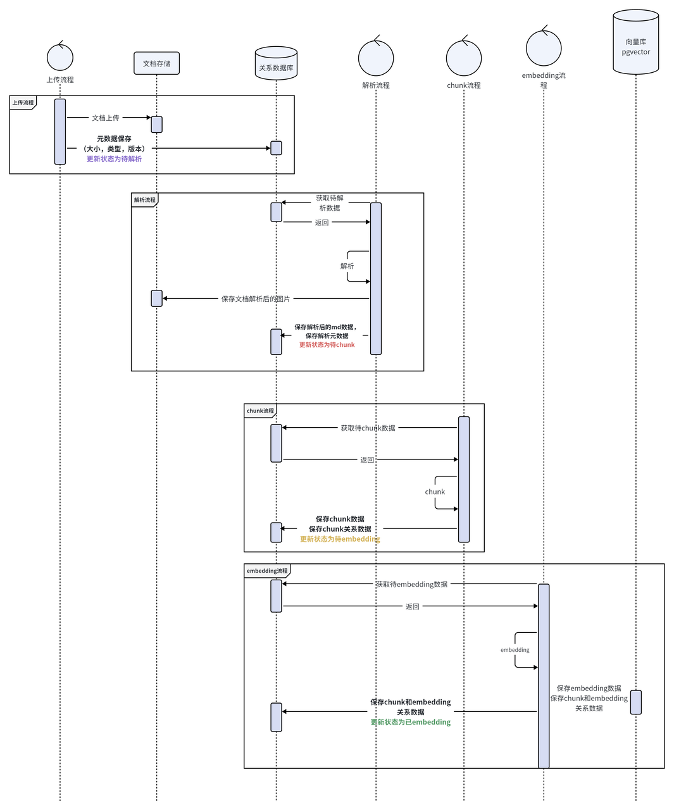
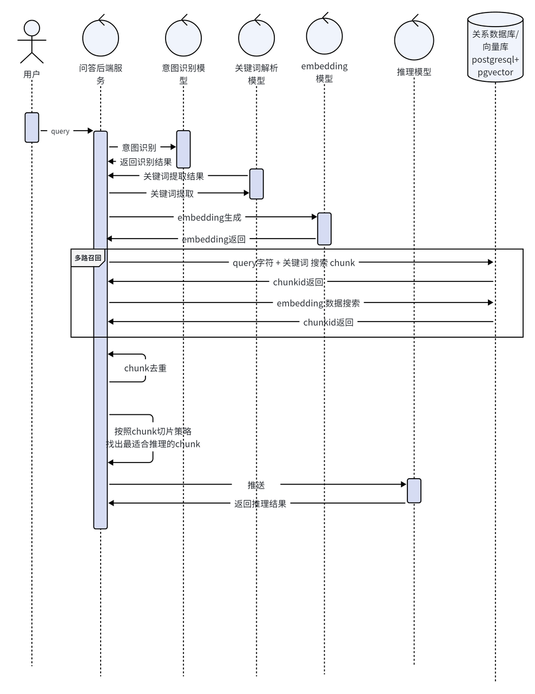
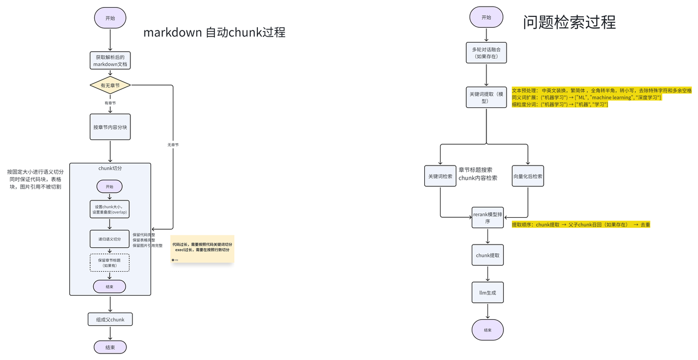
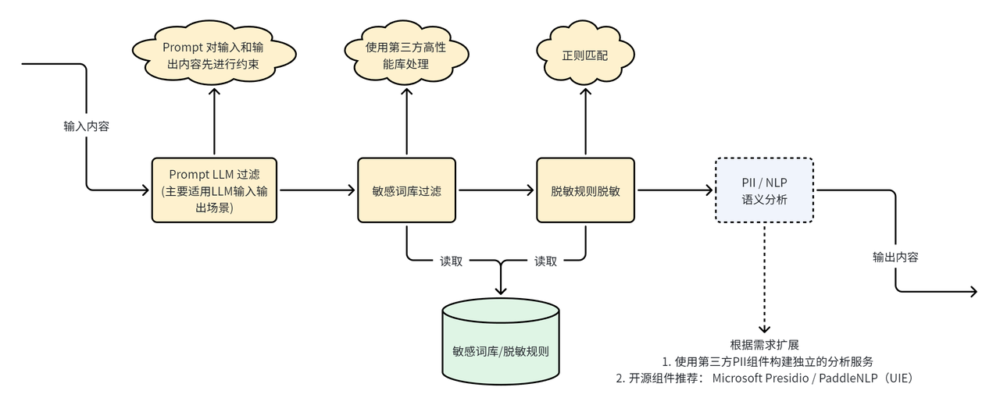
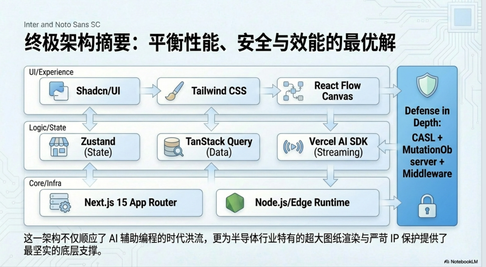
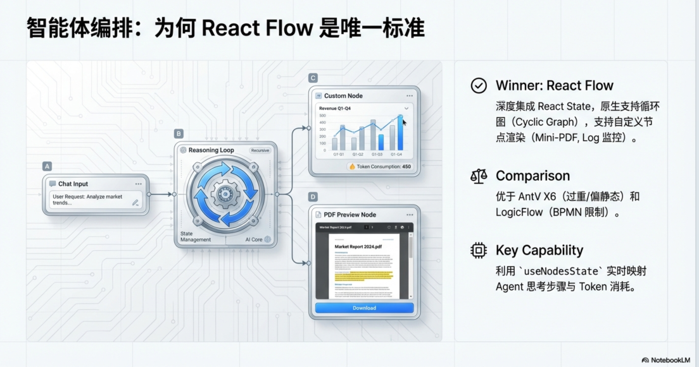
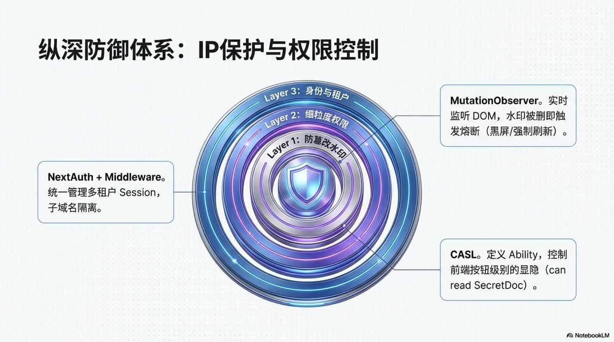

## 系统架构

备注：（新服务）表示现在系统没有需要新建的，（已有）现在系统有的，可以直接调用的外部服务。

#### 不做什么（明确排除）

* ❌ 不做用户登录/权限体系

* ❌ 不做多文档/多知识库管理

* ❌ 不做文件版本控制

* ❌ 不做知识图谱/标签系统

* ❌ 不做 Rerank 重排序（Top-K 向量检索即可）

* ❌ 不做安全防御（Prompt 注入检测）

* ❌ 不做运营报表/审计日志

* ❌ 不做 OCR（仅支持文本型 PDF，不支持扫描件）

#### 两个FastApi 微服务（新服务）

服务1： knowledge-base-service: 文档知识服务，负责上传、解析、切片、向量化、索引与文档状态管理

服务2： qa-service: 问答服务，负责检索、生成、会话、引用装配、摘要推荐与反馈

两个服务都要依赖的基础RAG组件：**Haystack**

#### LLM服务（已有）

所有模型服务通过litellm统一对接。

### 对象存储（新服务）

开源文档存储，SeaweedFS 。支持标准S3协议

### 数据库+向量库（新服务）

postgresql，pgvector


## 核心数据流转

* **知识库管理端主流程-文档上传&解析\&chunk&向量化**



* **问答端-主流程 （意图识别<包含思考过程>→关键词提取→query向量化→query检索&向量检索->chunk重组<按照chunk策略重组>→生成推理）**



## 核心模块

单步逻辑，或者单API调用的流程定义为简单流程。

多步逻辑，或者涉及到多组件调用定义为复杂流程。

| **大模块**    | **子模块**       | **模块复杂度**                                                                | **是否涉及模型** | **关系数据库** | **ES** | **向量库** | **文档存储（写）** |
| ---------- | ------------- | ------------------------------------------------------------------------ | ---------- | --------- | ------ | ------- | ----------- |
| **知识库管理端** | **文档上传**      | <span style="color: rgb(46,161,33); background-color: inherit">简单</span> | ❌          | ✅         | ❌      | ❌       | ✅           |
|            | **文档解析**      | 复杂                                                                       | ✅❔️        | ✅         | ❌      | ❌       | ✅           |
|            | **chunk流程**   | 复杂                                                                       | ✅          | ✅         | ✅      | ❌       | ❌           |
|            | **Embedding** | <span style="color: rgb(46,161,33); background-color: inherit">简单</span> | ✅          | ❌         | ❌      | ✅       | ❌           |
| **问答端**    | **意图识别**      | 复杂                                                                       | ✅          | ❌         | ❌      | ✅       | ❌           |
|            | **关键词提取**     | 复杂                                                                       | ✅          | ✅❔️       | ✅❔️    | ❌       | ❌           |
|            | **query向量化**  | <span style="color: rgb(46,161,33); background-color: inherit">简单</span> | ✅          | ❌         | ❌      | ✅       | ❌           |
|            | **全文检索**      | 复杂                                                                       | ❌          | ❌         | ✅      | ❌       | ❌           |
|            | **向量检索**      | 复杂                                                                       | ❌          | ❌         | ❌      | ✅       | ❌           |
|            | **rerank重排**  | <span style="color: rgb(46,161,33); background-color: inherit">简单</span> | ✅          | ❌         | ❌      | ❌       | ❌           |
|            | **chunk重组**   | 复杂                                                                       | ❌          | ✅         | ❌      | ❌       | ❌           |
|            | **生成推理**      | <span style="color: rgb(46,161,33); background-color: inherit">简单</span> | ✅          | ❌         | ❌      | ❌       | ❌           |

#### **文档管理**

* **文档存储**

**SeaweedFS** 是一个开源的分布式对象存储系统，专为海量小文件设计，由 Facebook 同类系统启发开发。

#### 核心优势

* ✅ **开源免费**：MIT 许可证，无任何商业限制

* ✅ **原生版本管理**：内置支持，无需额外开发

* ✅ **S3 完全兼容**：支持标准 S3 API

* ✅ **轻量级部署**：单机或集群模式，资源占用低

* ✅ **高性能**：专为小文件优化，读写速度快

* ✅ **活跃社区**：GitHub 18k+ Stars，持续维护

* ✅ **企业验证**：受 Facebook Haystack 启发

#### **文档解析**

* **支持解析格式**

  * PDF解析&#x20;

  * Docx (word文档)

  * Csv,xlsx （表格）

  * pptx（ppt）

  * Txt, md&#x20;

  * 视频解析（未来可拓展）

* **解析方案 (基于Rag-Anything 项目调研)**

  * **docling解析**

    * 支持所有格式，直接解析

    * **推荐理由：推荐Docling, 本次产品需求的事精简版不需要设置太多策略**


#### **Embedding**

* 向量数据库 指定pgvector

* 向量服务对接litellm提供的 text-embedding-v1/v2

#### chunk策略和召回核心流程 &#x20;



#### chunk策略实现

**基于递归语义切分的扩展**

* 正则表达式提取

  * 代码块提取

  * 表格块提起

  * 图片引用提取

* 代码切分（按照编程语言关键词）

  * Langchain 的 RecursiveCharacterTextSplitter （支持"cpp","go","java","kotlin","js","ts","php","proto","python","rst","ruby","rust","scala","swift","markdown","latex","html","sol","csharp","cobol","c","lua","perl","haskell"）

* 表格切分

  * 特定分隔符

* 递归语义切分  （依赖分隔符）

  * Langchain 的 RecursiveCharacterTextSplitter

  * Haystack 的 RecursiveDocumentSplitter

* 章节切分  （依赖markdown的标题层级）

  * Langchain 的 MarkdownHeaderTextSplitter

## 数据库

选postgresql，这样向量库和关系数据库都是postgresql，减少部署复杂度

## 服务端框架（RAG 场景及二次开发）

### 目标场景：

针对 RAG（Retrieval-Augmented Generation，检索增强生成）工作流，调研 **Haystack**、**LangChain** 和 **Dify** 在支撑 RAG 场景下二次开发的能力、组件化集成效率及多向量存储适配性，分析其对主要开发需求（如工作流灵活性、可扩展性、调试和优化能力）的支持情况。


虽然可视化编排功能仍是未来规划的一部分，但目前的调研重点是这些工具在 RAG 场景中的开发便捷性及二次开发可能性。


### 核心框架对比

#### 工具简介

* **Haystack**：开源的 NLP 框架，专注于以 Pipeline 为核心的模块化工作流。主要用于 RAG 场景（检索增强生成）、QA 系统搭建，支持多存储后端和生成模型，具备高度模块化和较低的二次开发门槛。

* **LangChain**：面向大语言模型（LLM）工具，用于设计复杂的任务链与 Agent 调度，强调动态任务链（Chains）及工具链（Tools）的扩展，适合灵活分支的动态场景管理。

* **Dify**：专注于生成式 AI 的任务模块设计，具备内置 Prompt 管理和任务流封装能力，初��使用和开发便捷性高，但在深度二次开发和灵活性上略有不足，适合快速构建与生成式任务开发。


### 组件分类及对比


如下表详细列出 **Haystack** Pipeline 的核心组件分类，并与 **LangChain** 和 **Dify** 的类似功能模块逐项对比。这些组件是 RAG 二次开发中的关键支持点：


| **组件分类**           | **Haystack 组件**                                                                                              | **功能描述**                              | **LangChain 对应功能**                                              | **Dify 对应功能**                      |
| ------------------ | ------------------------------------------------------------------------------------------------------------ | ------------------------------------- | --------------------------------------------------------------- | ---------------------------------- |
| **检索器（Retriever）** | `DensePassageRetriever` `BM25Retriever` `EmbeddingRetriever`  `ElasticsearchRetriever` `MultiModalRetriever` | 检索文档或数据段的核心组件，支持稠密向量和稀疏检索。            | - `VectorstoreRetriever`（支持 Pinecone/FAISS等向量库）`BM25 Retriever` | - 无内置明确模块，仅提供与向量存储的连接（如 Chroma）    |
| **阅读器（Reader）**    | `FarmReader` `TransformersReader` `TableReader`                                                              | 针对上一步检索结果，进行抽取答案，支持表格处理与段落抽取。         | - `LLM Chain`：使用 LLM 提取输入答案                                     | - 嵌套在任务模块中，通常依赖 OpenAI 的 GPT 等 API |
| **生成器（Generator）** |  `RAGenerator`                                                                                               | 基于生成式模型（如 T5、BART）生成答案，不依赖传统抽取器方式。    | - `LLM Chain`：直接用 LLM 生成答案                                      | - 提供 Prompt 管理，嵌套 GPT、生成答案         |
| **过滤器（Filter）**    | `DocumentFilter`                                                                                             | 根据元数据或特定规则，过滤检索结果中的文档。                | - 条件筛选器通常需自定义代码实现，无专有模块                                         | - 通过模块化接口支持简单筛选，不过能力有限             |
| **排序器（Ranker）**    | `SentenceTransformersRanker` `BM25Ranker`                                                                    | 对检索候选文档进行重排序，支持语义模型和 BM25 策略加权。       | - 与 Retriever 配合调用的 re-rank 工具，未提供独立 Ranker API                 | - 默认未支持单独排序机制                      |
| **知识库集成**          | `FAISS` `ElasticsearchDocumentStore` `Weaviate` `Milvus`                                                     | 支持多种向量库和文档存储引擎，适用于灵活的知识库对接场景。         | - 核心支持：Pinecone、FAISS、Chroma 等向量库                               | - 默认使用 Chroma，扩展其他向量存储需自行添加配置      |
| **文本转换**           | `PreProcessor` `PDFToTextConverter` `TextCleaningConverter` `DocxConverter`                                  | 提供多种文档预处理组件，包括从 PDF 提取文本、清理内容、格式化等功能。 | - 未提供对应组件，整理功能需依赖 Hugging Face 或外部库                             | - 用户自行配置预处理逻辑，非组件化设计               |


### 各框架 RAG 场景开发对比


#### **1. 工作流适配性**


|                   | **Haystack**                                                  | **LangChain**                  | **Dify**                      |
| ----------------- | ------------------------------------------------------------- | ------------------------------ | ----------------------------- |
| **核心结构**          | Pipeline（节点式工作流）<br />原生支持（并行，条件分支，循环，子流程嵌套等）&#xA;（已写demo验证过） | Chains（链式结构） + Agent（动态任务工具链）  | Modules（任务模块定义）               |
| **检索增强生成支持（RAG）** | 内置结构良好的 Retriever + Reader + Generator，专注于知识库问答流              | 强调动态链组合，适合灵活任务生成，但知识库适配工具需手工配置 | 偏重 Prompt 编排能力，与知识库检索的天然适配性较弱 |
| **深度定制能力**        | 高：所有节点（Node）均可自定义实现，用于高级开发                                    | 高：灵活扩展 Agent，使其动态适配复杂任务分支      | 中：任务模块粒度较高，深度定制要求更复杂          |


#### **2. 扩展和集成能力**


| **能力维度**    | **Haystack**                                                             | **LangChain**                            | **Dify**                 |
| ----------- | ------------------------------------------------------------------------ | ---------------------------------------- | ------------------------ |
| **向量存储适配性** | **极强**：支持 FAISS、Milvus、Weaviate、Pinecone 等多库，同时兼容 Elasticsearch          | **强**：通过工具链支持 Pinecone 和 Chroma；FAISS 集成 | **一般**：默认 Chroma，扩展需手工适配 |
| **二次开发灵活性** | 提供丰富 Node 开发接口，支持灵活插入自定义逻辑                                               | 强调工具链重组能力，可动态添加自定义链逻辑                    | 偏向生成式任务的封装能力，深度定制受限制     |
| **工具封装**    | 可以将任何组件和pipeline 发布为 llm 可调用的tool ，<br />对应部署成http服务，或者模型服务，需要自己封装<br /> | 自己封装                                     | 原生支持将应用封装成http服务，或者模型服务  |
| **集成方式**    | Import  ，不需要独立部署                                                         | Import ，不需要独立部署                          | 需要独立部署                   |


### 总结与选择建议


| **对比维度**      | **Haystack**      | **LangChain** | **Dify**     |
| ------------- | ----------------- | ------------- | ------------ |
| **RAG 工作流支持** | **强**：检索+增强+生成一体化 | 强：动态灵活拼接任务分支  | 一般：适配知识库受限   |
| **二次开发支持**    | 高：扩展能力强           | 高：工具链动态扩展灵活   | 中：深度修改难度更大   |
| **知识库适配性**    | 极强：全面支持多向量存储      | 强：适配主流向量库工具   | 一般：Chroma 优先 |

**Haystack代码样例**

```python
# 添加组件
pipeline.add_component("classifier", TextLengthClassifier())
pipeline.add_component("router", ConditionalRouter())
pipeline.add_component("quick_processor", QuickProcessor())
pipeline.add_component("detailed_processor", DetailedProcessor())
pipeline.add_component("joiner", ResultJoiner())

# 连接组件
# classifier -> router
pipeline.connect("classifier.text", "router.text")
pipeline.connect("classifier.category", "router.category")

# router -> processors (条件分支)
pipeline.connect("router.short_text", "quick_processor.text")
pipeline.connect("router.long_text", "detailed_processor.text")

# processors -> joiner
pipeline.connect("quick_processor.result", "joiner.quick_result")
pipeline.connect("detailed_processor.result", "joiner.detailed_result")
pipeline.connect("router.selected_category", "joiner.selected_category")
```

<span style="color: inherit; background-color: rgb(98,210,86)">RAG 与二次开发优先：首选 </span>**<span style="color: inherit; background-color: rgb(98,210,86)">Haystack</span>**<span style="color: inherit; background-color: rgb(98,210,86)">，其模块化设计和全面的知识库适配能力适合长期扩展。</span>


#### 敏感词过滤和数据脱敏

* **场景分析**

以下仅针对文本类型数据进行分析，暂无考虑多模态情况，如图片、视频资源等。

<table>
<thead>
<tr>
<th><strong>分析维度</strong></th>
<th><strong>敏感词过滤</strong></th>
<th><strong>数据脱敏</strong></th>
</tr>
</thead>
<tbody>
<tr>
<td><strong>核心目的</strong></td>
<td><strong>识别风险</strong></td>
<td><strong>保护隐私同时保留语义</strong></td>
</tr>
<tr>
<td>典型例子</td>
<td>政治词、辱骂词</td>
<td>手机号、身份证</td>
</tr>
<tr>
<td>输出结果</td>
<td>命中 / 不命中</td>
<td>替换后的文本</td>
</tr>
<tr>
<td><strong>词/规则规模</strong></td>
<td><strong>万级、十万级</strong></td>
<td><strong>个位数～几十个</strong></td>
</tr>
<tr>
<td>匹配方式</td>
<td>子串匹配</td>
<td>模式匹配</td>
</tr>
<tr>
<td>算法本质</td>
<td>多模式字符串搜索</td>
<td>模式识别 + 重写</td>
</tr>
<tr>
<td><strong>最优算法</strong></td>
<td><strong>AC / DFA</strong></td>
<td><strong>正则 + 策略</strong></td>
</tr>
<tr>
<td>是否需要NLP（语义识别）</td>
<td>极少</td>
<td>结构化数据不需要</td>
</tr>
<tr>
<td><strong>业务场景</strong><br /></td>
<td><ul>
<li>用户输入</li>
<li>文档入库</li>
<li>LLM输出</li>
</ul></td>
<td><ul>
<li>文档入库（可选）</li>
<li>LLM输入（调用其他外部模型）</li>
<li>LLM输出</li>
</ul></td>
</tr>
</tbody>
</table>

* **处理流程**




* **方案实施**

  * 敏感词过滤

  各端根据维护的敏感词库，使用高性能算法库处理。依赖库特点：匹配速度较常规正则匹配快几十到上百倍，性能可以在毫秒级内完成万级别的敏感词过滤：

  Java: sensitive-word 【https://github.com/houbb/sensitive-word】

  Python: pyahocorasick 【https://pypi.org/project/pyahocorasick/】

  Nodejs/JS: mint-filter 【https://www.npmjs.com/package/@q78kg/mint-filter】


  * 数据脱敏

各端根据脱敏规则，**采用常规正则表达式处理**即可。通常规则数据量少，脱敏处理的在性能和时间上损耗都较少，一般可以忽略。


## 前端技术选型

### 简述

企业级AI应用正从单一的“对话框”向“复杂的Agent工作流”演进。为了支撑未来3-5年的业务发展，我们需要一个既能快速响应业务变化，又能承载工业级数据安全的前端架构。

本方案确立了 **Next.js + React Flow + Shadcn/UI** 的“黄金技术栈”。其核心价值在于：

1. **研发效能倍增**：全面适配 **Vibe Coding** 模式（AI辅助编程），利用AI对React生态的极高代码生成率，降低开发成本。

2. **企业级落地**：内置多租户隔离、纵深防御安全体系（水印/权限）及工业级大图/文档渲染能力。


### **核心技术栈决策**




| **架构分层**  | **选型决定**                    | **核心决策理由**                                                              |
| --------- | --------------------------- | ----------------------------------------------------------------------- |
| **应用框架**  | **Next.js 15 (App Router)** | AI原生适配：LLM训练语料中最丰富的框架，AI生成代码准确率远高于Vue。原生支持Streaming（流式渲染），完美契合AI逐字输出特性。 |
| **UI 系统** | **Shadcn/UI + Tailwind**    | 白盒化定制：源码拷贝（Copy-paste）策略允许AI直接修改组件底层逻辑，彻底解决样式覆盖难题，适应Vibe Coding模式。      |
| **编排引擎**  | **React Flow (XYFlow)**     | 行业标准：Dify、LangFlow等主流Agent平台的事实标准。原生支持循环图（Cyclic Graph）与复杂状态映射。         |
| **状态管理**  | **Zustand**<br />           | 极简轻量：相比Redux更轻量，且是React Flow内部使用的库，能够高效处理画布高频拖拽带来的状态更新。                 |
| **安全/权限** | **NextAuth + CASL**         | 全栈安全：CASL处理前端按钮级显隐，NextAuth处理身份认证与多租户Session管理。                         |


### 开源架构对比

| **对比维度**    | Dify       | FastGPT    | RAGFlow    | MaxKB     | **最终选型**                 |
| ----------- | ---------- | ---------- | ---------- | --------- | ------------------------ |
| **应用框架**    | Next.js    | Next.js    | UmiJS      | Vue3      | **Next.js**              |
| **UI系统**    | Tailwind   | ChakraUI   | Ant Design | ElementUI | **Shadcn/UI + Tailwind** |
| **Agent编排** | React Flow | React Flow | Ant X6     | LogicFlow | **React Flow**           |


### **关键组件/技术细节**

1. **AI智能问答渲染套件 (Rich Markdown)**

| **组件/库**                           | **用途**        | **关键实现逻辑**                                                                                       |
| ---------------------------------- | ------------- | ------------------------------------------------------------------------------------------------ |
| **Vercel AI SDK + TanStack Query** | 流式信息处理SDK     | 处理流式响应的神器。自动管理消息列表状态、输入框状态以及 Loading 状态。它还支持 **Optimistic UI**（乐观更新），即用户发送消息后立即显示在界面上，无需等待服务器确认。 |
| **react-markdown**                 | Markdown 解析基座 | 配合 remark-gfm 支持表格/链接。禁用 dangerouslySetInnerHTML 防止 XSS。                                         |
| **react-syntax-highlighter**       | 代码高亮<br />    | 拦截 code 标签。检测语言类型，提供复制按钮和行号。<br />可以支持（tcl, shell, verilog 等半导体行业常用语言）                           |
| **mermaid + react-mermaid2**       | 流程图/时序图       | 拦截 lang="mermaid" 的代码块，动态渲染为 SVG 图表。<br />                                                       |
| **rehype-katex**                   | 数学公式          | 渲染 LaTeX 公式（如半导体物理公式）。                                                                           |
| **自定义 DataGrid**                   | 表格数据分析        | 若 AI 返回 CSV 格式，自动渲染为 **Ag-Grid** 或 **TanStack Table**，支持排序筛选。                                    |
| **其他自定义组件**                        | 自定义           | 为满足需求，如果没有现成的开源组件，可以基于**react-markdown**开发自定义的新组件。                                               |


* **文档在线查看**

| **组件/库**                  | **用途**              | **关键实现逻辑**                                                | **场景**                 |
| ------------------------- | ------------------- | --------------------------------------------------------- | ---------------------- |
| **react-pdf**             | PDF 预览              | 配合 **react-window** 实现**虚拟滚动**（Virtualization），仅渲染当前视口页面。 | 50MB+ PDF 大文件打开速度与内存占用 |
| **react-doc-viewer-plus** | 其他非PDF格式的Office文档预览 | 离线环境下Office文档的在线预览，没有特别适合的方案，预览效果和文档实际效果可能会存在显示上的差异       | 非PDF格式文档预览             |


* **适应智能体的流程编排组件**




* **安全防御组件**

| **组件/库**                   | **用途**        | **关键实现逻辑**                                      | **场景**        |
| -------------------------- | ------------- | ----------------------------------------------- | ------------- |
| **NextAuth**<br />         | 鉴权中间件可实现多租户场景 | 使用NextAuth+Middleware，控制用户权限和租户隔离<br />         | 用户鉴权          |
| **CASL**                   | 细粒度权限         | 定义 Ability (如 can('read', 'SecretDoc'))，控制按钮显隐。 | 前端按钮显示        |
| **MutationObserver**<br /> | 防篡改水印         | 监听 DOM 变动，一旦水印节点被删除或属性修改，触发熔断（刷新/黑屏）。           | 打开开发者工具删除水印节点 |




* **前端水印方案**

  * 前端页面水印

  前端水印使用 **Canvas/SVG 结合 MutationObserver** 的方案，具体组件为：

  * **Watermark-js-plus:** 一个强大的现代前端生成水印库，支持生成动态水印（用户名、IP、时间戳）、图片水印、暗水印等。

  * **防删除机制:** 利用 `MutationObserver` 监听 DOM 变化。如果用户试图在 F12 里删除水印层，系统会自动重新渲染或直接中断页面显示。Watermark-js-plus 组件自带`MutationObserver` 属性配置。

  * 文档水印

  针对可以下载的PDF文档添加水印。

  * **pdf-lib (JS)：**&#x4E00;个功能强大的PDF处理库，可以为PDF文件添加自定义水印。

  * **LibreOffice：**&#x975E;PDF类型的文档不支持直接添加水印，**需要先在服务端利用 LiberOffice 进行转格式**处理，统一处理为PDF格式后，再进行打水印。


### 兼容性分析

* **浏览器兼容**

综合分析了NextJS 15(React 19)，Shadcn UI, TailWinds(v4）以及关键组件 react-markdown, react-pdf, react-flow 的浏览器兼容情况，推荐浏览器版本如下：

* Chrome 111+

* Edge 111+

* Firefox 128+

* Safari 16.4+

**其中Linux系统（centos7/ubuntu 20.04/ubuntu 22.04）上如果自带Firefox版本较低，可以直接下载Firefox官方最新安装包，在系统中解压后，替换掉默认的Firefox可执行文件即可完成版本升级，建议直接升级到Firefox 145+**。


* **客户端兼容**

针对 NextJS + Tailwind 网页打包客户端的方案有两种，**Electron** 与 **Tauri** 。二者在Windows和macOS平台的系统兼容性较好，重点说下Linux平台。

| **系统**       | **Electron**                                                                                                             | **Tauri V2**                                                                    | **Tauri V1**                                                                          |
| ------------ | ------------------------------------------------------------------------------------------------------------------------ | ------------------------------------------------------------------------------- | ------------------------------------------------------------------------------------- |
| Centos 7     | <span style="color: inherit; background-color: rgba(183,237,177,0.8)">支持</span>，但只能使用旧版本，最高Electron22或19<br />受限于GLIBC版本 | 完全不支持<br />受限于GLIBC和GTK库                                                        | 默认不支持<br />需要手动维护环境依赖，且非常不稳定                                                          |
| Ubuntu 20.04 | <span style="color: inherit; background-color: rgba(183,237,177,0.8)">支持</span><br />                                    | 默认不支持<br />需要手动维护环境依赖，且运行不稳定                                                    | <span style="color: inherit; background-color: rgba(183,237,177,0.8)">支持</span><br /> |
| Ubuntu 22.04 | <span style="color: inherit; background-color: rgba(183,237,177,0.8)">支持</span>                                          | <span style="color: inherit; background-color: rgba(183,237,177,0.8)">支持</span> | <span style="color: inherit; background-color: rgba(183,237,177,0.8)">支持</span>       |

小结：

1. 浏览器兼容性上可以满足需求，如果真实环境的浏览器版本较低，可以通过安装包方式升级浏览器版本

2. **Electron + AppImage + 兼容构建环境**，即借助docker容器化环境在指定Linux操作系统版本下使用Electron进行打包构建。遵循**在低版本系统中编译，在高版本系统中运行**的原则。


### 总结

本项目的前端技术选型并非单纯的框架堆砌，而是针对**AI时代开发模式（Vibe Coding）与企业级高标准需求**的精准应答。

* **Next.js 15** 提供了坚实的框架基础和 AI 编程的语料优势。

* **Shadcn/UI + Tailwind** 解决了定制化难题，让“Vibe Coding”成为可能，大幅减少重复开发。

* **React Flow** 为未来的 Agent 编排提供了目前业界唯一的标准解法。

* **Vercel AI SDK 与 NextAuth&#x20;**&#x5206;别在 AI 交互与企业级安全上补齐了最后一块拼图。


这套架构既具备了ToB系统应有的稳重与安全，又赋予了开发团队极速迭代的能力，是当前技术背景下的最优解。不仅满足了当前的核心业务需求，更在可维护性、AI 辅助开发效率以及未来扩展性之间取得了最佳平衡，是构建大模型知识库系统的最优解。


