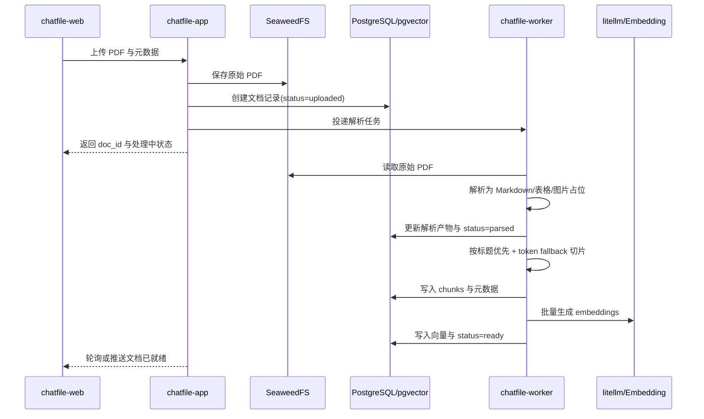
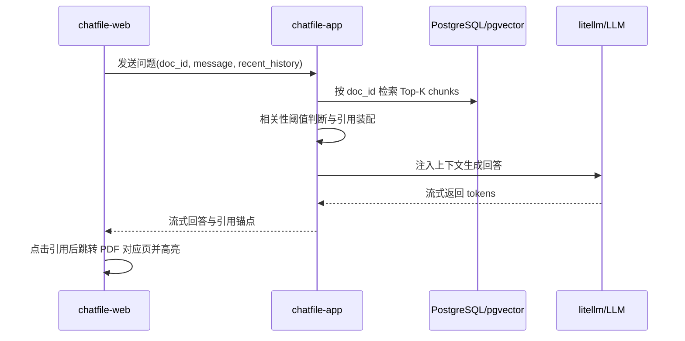

# ChatFile 架构设计

## 背景与目标

ChatFile 是一个面向单文档问答场景的极简 Web 应用，目标是让用户上传一份 PDF 后，在当前文档范围内完成解析、检索和多轮对话，并为回答提供可点击的引用溯源。

本轮架构设计聚焦 P0 与部分 P1 能力的稳定交付，覆盖文档上传、解析、切片、向量化、单文档问答、引用跳转、自动摘要、推荐问题和反馈入口。

本轮明确不覆盖以下范围：
- 用户登录与权限体系
- 多文档知识库管理
- 文件版本控制
- OCR
- Rerank、知识图谱、运营报表、安全防御体系

## 架构约束与输入依据

### 输入材料清单

- [PRD.md](/home/dministrator/codexWorkspace/DpProject10/docs/01-prd/PRD.md)
  - 定义了单文档、5 分钟处理上限、严格按 `doc_id` 检索、低相关直接拒答、引用跳页等核心约束。
- [research.md](/home/dministrator/codexWorkspace/DpProject10/docs/01-prd/research.md)
  - 提供了 FastAPI、Haystack、SeaweedFS、PostgreSQL/pgvector、litellm 等候选技术和文档处理、问答链路参考流程。
- [ChatFile_interactive.md](/home/dministrator/codexWorkspace/DpProject10/docs/01-prd/ChatFile_interactive.md)
  - 明确了上传状态机、左右分栏、PDF 预览、引用点击跳转、欢迎态摘要与推荐问题等前端交互边界。
- [ChatFile_调研文档-image.png](/home/dministrator/codexWorkspace/DpProject10/docs/01-prd/images/ChatFile_调研文档-image.png)
  - 指向上传、解析、切片、embedding 的异步流水线，支撑 worker 边界设计。
- [ChatFile_调研文档-image-1.png](/home/dministrator/codexWorkspace/DpProject10/docs/01-prd/images/ChatFile_调研文档-image-1.png)
  - 提供问答链路参考，但其中意图识别、关键词提取等步骤不作为本轮硬依赖。
- [ChatFile_调研文档-image-2.png](/home/dministrator/codexWorkspace/DpProject10/docs/01-prd/images/ChatFile_调研文档-image-2.png)
  - 说明标题优先切片与 token fallback 切片的双层策略。
- [ChatFile_调研文档-image-3.png](/home/dministrator/codexWorkspace/DpProject10/docs/01-prd/images/ChatFile_调研文档-image-3.png)
  - 是内容安全链路调研，本轮仅作为未来扩展参考，不纳入首版必做能力。
- [ChatFile_调研文档-image-4.png](/home/dministrator/codexWorkspace/DpProject10/docs/01-prd/images/ChatFile_调研文档-image-4.png)
  - 支撑前端采用 Next.js 的调研方向，但其中企业平台化能力不直接纳入首版范围。
- [ChatFile_调研文档-image-5.png](/home/dministrator/codexWorkspace/DpProject10/docs/01-prd/images/ChatFile_调研文档-image-5.png)
  - 是智能体编排调研，与当前单文档问答架构关联较弱，不作为当前模块拆分依据。
- [ChatFile_调研文档-Enterprise_AI_Agent_Platform_Blueprint_09.jpg](/home/dministrator/codexWorkspace/DpProject10/docs/01-prd/images/ChatFile_调研文档-Enterprise_AI_Agent_Platform_Blueprint_09.jpg)
  - 是纵深防御调研图，本轮仅保留为后续平台化阶段参考。

### 关键约束

- 单文档范围内回答，不允许跨文档召回。
- 首版只支持文本型 PDF，不支持扫描件 OCR。
- 文档处理链路需在 5 分钟内完成超时控制。
- 问答必须带引用锚点，点击后能定位到 PDF 页码。
- 当检索相关性不足时，系统必须拒答，不允许编造。
- 架构要优先服务 MVP 落地，避免为了未来扩展提前拆成多后端微服务。

## 业务域划分

本轮采用极简双域划分。

### document-ingestion-domain

职责：
- 接收 PDF 上传
- 管理原始文档存储
- 执行解析、切片、向量化
- 管理文档处理状态与失败原因
- 输出供问答使用的 chunk、embedding 与引用定位元数据

该业务域拥有文档处理相关主数据，是所有问答能力的上游提供方。

### conversation-domain

职责：
- 接收用户问题与最近多轮上下文
- 在当前 `doc_id` 范围内完成检索
- 组织上下文并调用 LLM 生成流式回答
- 装配引用锚点
- 维护会话历史、摘要、推荐问题与反馈

该业务域不拥有文档原始内容，只消费 ingestion 域输出的可检索数据。

## 服务与模块边界

本轮采用“单服务内部分模块 + 异步 worker + 前端”的折中方案。

### 服务划分

- `chatfile-web`
  - 前端应用，负责上传交互、对话区、PDF 预览、引用跳转、欢迎态摘要与推荐问题展示。
- `chatfile-app`
  - 主应用服务，对外提供统一 API，内部承载 `document-ingestion-domain` 与 `conversation-domain` 的同步访问入口。
- `chatfile-worker`
  - 异步任务执行器，负责解析、切片、embedding、自动摘要和推荐问题等重处理任务。

### 模块划分

## 后端微服务划分
- document-ingestion: 文档处理模块，负责上传、状态管理、解析产物落盘、切片和向量化任务编排
- conversation-orchestrator: 问答编排模块，负责检索、回答生成、引用装配、会话与反馈
- chatfile-web: 前端交互模块，负责上传流程、聊天体验、PDF 预览与引用联动

### 边界原则

- `chatfile-app` 统一接收前端请求，但模块职责保持清晰，不能以控制器层混写代替边界。
- `chatfile-worker` 不直接对外提供用户接口，只消费任务并回写状态。
- 文档处理与问答链路通过数据库中间状态和稳定的文档/切片元数据协作，而不是共享临时内存状态。
- 前端引用跳转以页码与 chunk 锚点为契约边界，段落级高亮精度可后续迭代增强。

## 核心技术选型与理由

### 后端与任务执行

- `FastAPI`
  - 适合作为 `chatfile-app` 与 `chatfile-worker` 的 Python 服务框架。
  - 便于承接文档处理与 RAG 组件集成。

### RAG 组件编排

- `Haystack`
  - 作为检索、文档预处理与生成编排的核心组件库。
  - 相比更平台化或更动态的方案，Haystack 更符合当前单文档 RAG 的稳态流程。

### 数据与存储

- `PostgreSQL + pgvector`
  - 关系数据和向量数据统一落在 PostgreSQL，降低部署与运维复杂度。
  - 适合当前单文档 MVP 的数据规模与一致性要求。
- `SeaweedFS`
  - 负责原始 PDF 与解析相关文件的对象存储。
  - 与应用层保持 S3 兼容交互，降低后续替换成本。

### 模型接入

- `litellm`
  - 统一接入本地 LLM 与 embedding 模型，避免应用层直接耦合具体模型供应方式。

### 前端

- `Next.js`
  - 负责上传状态机、流式对话、左右分栏、PDF 预览和引用联动。
  - 与交互文档的页面结构和流式输出需求匹配。

### 本轮显式不纳入核心链路的调研项

- 意图识别
- 关键词提取
- Rerank
- Elasticsearch
- 多租户鉴权与水印防护体系
- Office 文档预览

这些内容可以作为后续增强项，但不作为当前架构成功交付的前提。

## 核心业务流程

### 流程一：文档上传到就绪



### 流程二：单文档问答



## 依赖契约摘要

- `chatfile-web -> chatfile-app`
  - 同步
  - 前端发起上传、状态查询、问答、反馈请求
  - `chatfile-app` 拥有接口契约与输入校验责任
  - 若失败，由 `chatfile-app` 返回可展示的业务状态，`chatfile-web` 负责用户提示

- `chatfile-app -> chatfile-worker`
  - 异步
  - `chatfile-app` 发起文档处理和摘要推荐任务
  - `chatfile-worker` 拥有任务执行责任与最终状态回写责任
  - 交付前置关系：worker 必须先具备处理链路，上传流程才可闭环

- `chatfile-app -> SeaweedFS`
  - 同步
  - 用于原始 PDF 和解析副产物的存取
  - 对象存储只负责文件持久化，不承担业务状态语义

- `chatfile-worker -> PostgreSQL/pgvector`
  - 同步
  - 写入文档状态、chunk 元数据与 embeddings
  - 文档处理数据由 ingestion 模块主拥有

- `conversation-orchestrator -> PostgreSQL/pgvector`
  - 同步
  - 在当前 `doc_id` 范围内检索 chunks 和引用元数据
  - 检索失败或低相关由 conversation 模块负责拒答

- `conversation-orchestrator -> litellm`
  - 同步流式
  - 用于问答生成与可选摘要/推荐生成
  - 模型不可用时由 conversation 模块负责降级提示，不转为无引用自由回答

## 数据归属与存储策略

- 原始 PDF 与解析副产物
  - 由 `document-ingestion` 主拥有
  - 存于 `SeaweedFS`

- 文档状态、失败原因、页数、切片数量等业务元数据
  - 由 `document-ingestion` 主拥有
  - 存于 `PostgreSQL`

- chunk 内容、`chunk_id`、`page_num`、`title_path`
  - 由 `document-ingestion` 主拥有
  - 存于 `PostgreSQL`

- embeddings
  - 由 `document-ingestion` 生成并主拥有
  - 存于 `pgvector`

- 会话历史、反馈记录、摘要与推荐问题
  - 由 `conversation-orchestrator` 主拥有
  - 存于 `PostgreSQL`

一致性策略：
- 文档处理链路采用阶段性状态推进，状态更新以数据库为准。
- 问答只读取 `ready` 状态文档，避免消费处理中间态。
- 会话与反馈不反向修改文档处理主数据，只建立关联引用。

## 异常处理与关键风险

### 异常处理原则

- 上传失败由 `chatfile-app` 在同步入口拦截，避免无效文件进入处理队列。
- 解析失败、切片失败、embedding 失败由 `chatfile-worker` 负责标记文档状态为 `failed` 并附失败摘要。
- 单文档处理超时统一按 5 分钟失败处理，不做无限重试。
- 检索低相关时，`conversation-orchestrator` 直接返回“文档中未找到相关信息”。
- 模型服务短暂失败时，只允许返回失败提示，不允许无检索上下文自由回答。

### 关键风险

- PDF 解析质量不稳定
  - 风险：表格与复杂版式可能影响切片质量和引用准确性。
  - 应对：首版只承诺文本型 PDF，复杂版式作为已知限制。

- 引用高亮精度有限
  - 风险：首版可能只能稳定做到页级定位与近似段落高亮。
  - 应对：先固化页码与 chunk 锚点契约，段落定位后续增强。

- 单数据库承载多种负载
  - 风险：关系查询、向量检索、会话写入集中在 PostgreSQL。
  - 应对：当前数据规模下可接受，后续若查询压力升高再考虑分离检索层。

- worker 队列未单独产品化
  - 风险：任务堆积会影响文档就绪时间。
  - 应对：架构上先保留独立 worker 边界，后续可替换更成熟的任务队列实现。

## 模块交接卡

```yaml
- module_id: document-ingestion
  module_name: Document Ingestion
  goal: 支撑 PDF 上传后的存储、解析、切片、向量化和文档状态推进
  owner_domain: document-ingestion-domain
  delivery_scope: backend
  frontend_surfaces:
    - 上传空状态
    - 上传进度与处理步骤展示
  ui_ownership_notes:
    - 前端只负责展示上传与处理状态，不拥有文档处理状态机的业务判定
  upstream_dependencies:
    - chatfile-web
    - SeaweedFS
    - litellm-embedding
  downstream_dependencies:
    - conversation-orchestrator
  input_contracts:
    - chatfile-web 通过同步上传能力提交单个 PDF 与基础元数据，document-ingestion 负责文件校验、持久化和任务创建
    - chatfile-worker 通过异步任务消费待处理文档，负责解析、切片和向量化执行
  output_contracts:
    - 通过同步查询能力向前端提供文档状态、页数、切片数量和失败原因摘要
    - 向 conversation-orchestrator 提供当前 doc_id 下可检索的 chunk、embedding 与引用定位元数据
  data_owner:
    - 原始 PDF
    - 文档处理状态
    - 解析产物
    - chunk 元数据
    - embeddings
  delivery_priority: P0
  open_questions:
    - 是否需要首版就保留解析后的 Markdown 原文下载能力

- module_id: conversation-orchestrator
  module_name: Conversation Orchestrator
  goal: 支撑单文档检索问答、流式生成、引用装配、多轮会话、摘要推荐与反馈
  owner_domain: conversation-domain
  delivery_scope: both
  frontend_surfaces:
    - 对话区
    - 欢迎态摘要与推荐问题
    - 回答引用列表
    - 点赞点踩反馈入口
  ui_ownership_notes:
    - 对话交互、流式渲染、推荐问题触发和反馈提交由前端承接
    - 拒答判定、引用装配和会话上下文截断策略由后端拥有
  upstream_dependencies:
    - document-ingestion
    - litellm-llm
  downstream_dependencies:
    - chatfile-web
  input_contracts:
    - chatfile-web 通过同步问答能力提交 doc_id、用户问题与最近多轮上下文，conversation-orchestrator 负责限定检索范围和生成回答
    - document-ingestion 通过稳定的 chunk 与引用元数据供本模块检索，不暴露实现级解析细节
  output_contracts:
    - 通过流式响应向 chatfile-web 输出回答片段、完成态消息和引用锚点
    - 通过同步查询或异步生成向 chatfile-web 输出文档摘要、推荐问题和反馈结果
  data_owner:
    - 会话历史
    - 反馈记录
    - 摘要结果
    - 推荐问题
  delivery_priority: P0
  open_questions:
    - 首版摘要与推荐问题是否在文档 ready 后立即异步生成，还是首次打开文档时按需生成

- module_id: chatfile-web
  module_name: ChatFile Web
  goal: 提供上传、处理状态展示、对话、PDF 预览和引用联动的统一前端体验
  owner_domain: conversation-domain
  delivery_scope: frontend
  frontend_surfaces:
    - 上传空状态
    - 上传进度与处理步骤条
    - 左右分栏布局
    - 对话区
    - PDF 预览区
    - 引用点击跳转
  ui_ownership_notes:
    - 负责上传交互、轮询或订阅状态、流式消息渲染和 PDF 预览联动
    - 不拥有文档处理、检索或引用判定逻辑，只消费稳定业务状态与引用元数据
  upstream_dependencies:
    - document-ingestion
    - conversation-orchestrator
  downstream_dependencies: []
  input_contracts:
    - document-ingestion 通过同步状态查询向前端提供文档状态、处理阶段和失败摘要
    - conversation-orchestrator 通过流式回答与同步元数据向前端提供消息、引用和推荐问题
  output_contracts:
    - 通过同步上传、问答、反馈和状态轮询请求驱动后端流程
    - 通过引用点击与高亮交互把用户定位到目标 PDF 页与近似段落
  data_owner:
    - 本地界面状态
    - 临时输入状态
  delivery_priority: P0
  open_questions:
    - 首版引用高亮采用 PDF 文本层定位还是 chunk 对应页内近似锚点方案
```

## 工作项清单

- document-ingestion: 文档处理模块，负责上传、状态管理、解析、切片、向量化与失败处理；PingCode 工作项 `CFD-60`，ID `69b7e35e8aadfd4b9f26ca29`
- conversation-orchestrator: 问答模块，负责检索、生成、会话、引用装配、摘要推荐与反馈；PingCode 工作项 `CFD-59`，ID `69b7e35e8aadfd4b9f26ca21`
- chatfile-web: 前端模块，负责上传体验、分栏界面、流式对话、PDF 预览与引用联动；PingCode 工作项 `CFD-61`，ID `69b7e35e8aadfd4b9f26ca31`

## 开放问题

- 摘要与推荐问题的生成时机是否固定在文档就绪后异步生成。
- PDF 段落高亮是否有可行的文本层定位方案，还是首版先接受页级跳转加近似高亮。
- `chatfile-worker` 的队列实现是否沿用轻量方案，还是在实现阶段引入更成熟的任务系统。
