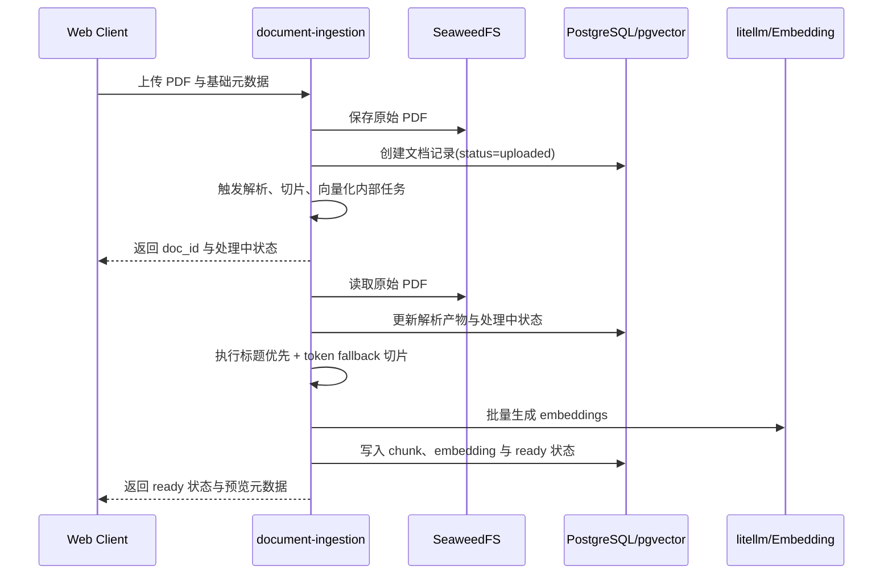
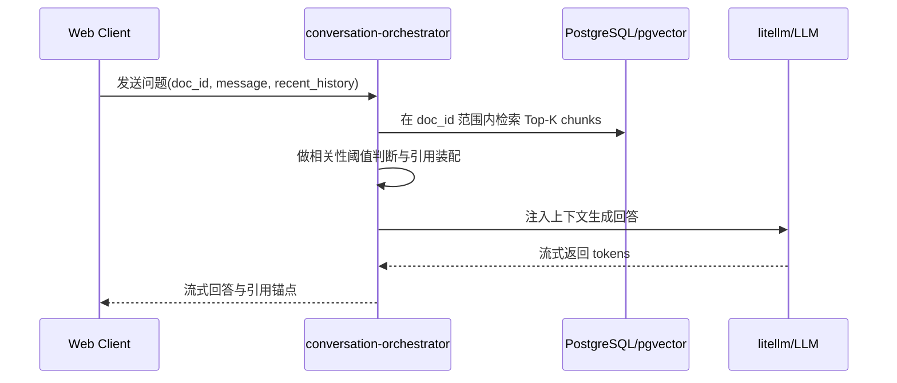

# 集成流程

## 1. 目标

本文件只描述跨服务协作流程，不进入服务内部代码或组件设计。

## 2. 流程一：文档上传到可问答

关键点：
- 上传返回要快，重处理在服务内部异步完成
- `ready` 前不允许进入问答主路径
- 引用定位元数据必须在 `ready` 前准备完毕

## 3. 流程二：单文档问答

关键点：
- 必须严格按 `doc_id` 检索
- 低相关必须拒答
- 回答必须带引用锚点

## 4. 关键异常路径

### 4.1 上传失败

- 无效文件在 `document-ingestion` 入口直接拦截
- 不进入后续处理链路

### 4.2 文档处理失败

- 解析、切片、embedding 任一环节失败时，文档状态置为 `failed`
- 对外只返回稳定失败摘要，不暴露内部实现细节

### 4.3 处理超时

- 单文档处理链路统一以 5 分钟为超时上限
- 超时后进入 `failed`

### 4.4 问答拒答

- 当检索相关性不足时，`conversation-orchestrator` 直接拒答
- 不允许模型自由发挥

### 4.5 模型服务异常

- 模型不可用时返回失败提示
- 不允许绕过检索或无引用回答
