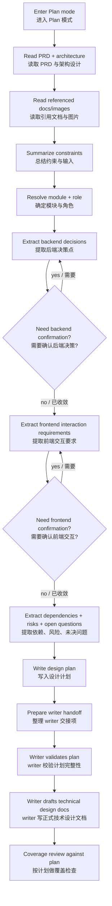

# Technical Design Planner / 技术设计写入计划

把 PRD、架构设计和引用材料整理成一份可被后续技术设计写作直接消费的计划文档。这个 skill 不产出正式技术设计正文，而是沉淀写入计划、设计约束、决策点、未决问题和覆盖检查项，避免后续写作时丢上下文。

<HARD-GATE>
Do NOT write the full technical design document in this skill.

You MUST:
1. enter Plan mode first
2. read the PRD, architecture design, and referenced docs/images
3. extract explicit constraints, decision points, and unresolved questions
4. create a planning document before any technical design prose is written
5. treat frontend interaction requirements as first-class inputs, not optional notes
</HARD-GATE>

## Scope / 使用范围

**Use this skill when**:
- 用户要先沉淀技术设计写入计划，再写正式文档
- 现有 `technical-design` 在长上下文中容易漏掉决策点或交互约束
- 需要把 PRD、架构文档、引用文档中的前端交互要求显式抽取出来

**Do NOT use this skill for**:
- 直接生成 `api-design.md`、`page-design.md`、`component-design.md`
- 从 0 开始做架构设计
- 直接拆实现任务

如果用户还没有稳定的 PRD 或架构设计，先指出输入缺口，不要勉强生成计划。

## Checklist / 执行清单

You MUST create a task for each item and complete them in order:

1. **Enter Plan mode**
2. **Read source context** - read `docs/01-prd/PRD.md` and `docs/02-architecture/architecture-design.md`
3. **Expand referenced material** - read referenced markdown/docs/images and `docs/01-prd/research.md` if it exists
4. **Resolve scope** - identify target module(s), role (`backend` / `frontend` / `both`), and dependencies
5. **Extract constraints** - summarize product, architecture, dependency, and delivery constraints
6. **Extract decision points** - list decisions required before final writing
7. **Extract frontend interaction requirements** - capture PRD and referenced-doc interaction expectations with traceability
8. **Record unresolved questions and risks**
9. **Write the planning doc** - save under `docs/03-technical-design-plans/{module}/`
10. **Prepare handoff for writer** - include explicit writing order and coverage checklist

## Process Flow / 处理流程



## Required Planner Outputs / 必须产出的内容

计划文档至少要包含：
- 模块范围与角色
- 对应的 `module_id`
- 模块交接卡摘要
- 输入材料清单
- 约束摘要
- 设计决策点清单
- 待确认问题
- 风险与依赖
- 技术设计正文写作提纲
- 覆盖检查清单

其中前端必须单独有一节：
- `Frontend Interaction Requirements`

这一节必须逐条记录：
- 来源文件
- 来源章节或图片
- 原始要求摘要
- 影响的页面或组件
- 触发条件
- 状态变化
- 用户反馈方式
- 动效或过渡要求
- 异常、空态、加载态、权限态
- 是否已在后续写作中强制覆盖

如果 PRD 或引用文档没有明确写交互效果，也要显式写明“未发现明确交互要求”，不要默默跳过。

## Process / 处理流程

### 1. Read Full Context First

必须读取：
- `docs/01-prd/PRD.md`
- `docs/01-prd/research.md`（如果存在） 
- `docs/02-architecture/architecture-design.md`
- 以上文档中引用的文档和图片

读取后要说明：
- 哪些文件真正影响后续技术设计
- 哪些约束来自主文档，哪些来自引用材料

### 2. Resolve Module Scope Before Extraction

优先基于架构文档中的 `module_id`、模块交接卡和依赖契约摘要确定范围。

默认策略：
- 一次只整理一个模块
- 除非用户明确要求，否则不要批量整理多个高耦合模块

强约束：
- 技术设计规划的最小单元始终是 `module_id`
- 不要把 `work item` 直接当成 `module_id`
- 如果一个 `work item` 覆盖多个模块，计划文档必须逐个模块拆开
- `service` 只作为实现承载关系参考，不用于重新定义技术设计边界
- 如果模块交接卡缺少前端归属、依赖责任或契约方向，应先标记缺口

### 3. Extract Decisions Instead of Freewriting

不要把计划文档写成散文。应结构化记录：
- 已知约束
- 需要决策的点
- 推荐方向
- 推荐依据
- 还缺什么信息

### 4. Treat Frontend Interaction as a Separate Track

对 frontend 或 `both` 场景，必须单独抽取：
- 用户旅程中的关键动作
- 页面转场或区域切换
- 动画、过渡、提示、反馈
- loading / empty / error / success / disabled / permission-denied
- 乐观更新、回滚、撤销、重试
- 弹窗、抽屉、toast、inline feedback

不要把这些内容混进组件设计备注里。它们必须在计划阶段就被固化。

抽取前端交互要求时，必须优先结合架构交接卡中的：
- `delivery_scope`
- `frontend_surfaces`
- `ui_ownership_notes`

如果 PRD 的用户旅程和架构交接卡中的前端归属不一致，要显式记录冲突，而不是自行选择其一。

### 5. Write the Plan Only After Extraction Completes

输出路径建议：

```text
docs/03-technical-design-plans/{module}/design-plan.md
```

章节骨架见 [references/templates.md](references/templates.md)。

## Quality Bar / 质量要求

计划文档必须让后续 writer skill 在不重新通读全部上下文的情况下，也能稳定写出技术设计文档。

如果出现以下情况，说明计划质量不够：
- 只有标题，没有明确决策点
- 没有把交互要求单独列出来
- 看不出哪些内容来自 PRD，哪些来自引用文档
- 没有覆盖检查项
- 没有标明未决问题和风险

## Handoff Rules / 交接规则

计划文档末尾必须包含：
- 推荐写作顺序
- 哪些章节必须先写
- 哪些依赖需要先确认
- 给 `technical-design-writer` 的覆盖要求

并且要显式说明：
- 哪些内容直接来自模块交接卡
- 哪些内容来自 PRD / research / 引用材料
- 哪些内容仍然缺少架构层定义，writer 不得自行假设

推荐写法：
- `writer_must_cover`
- `writer_must_not_assume`
- `writer_open_questions`
