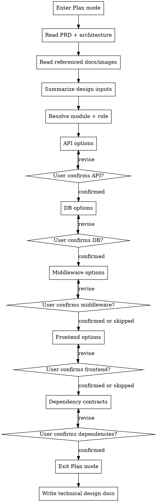

# Technical Design

将 PRD 和架构设计转化为可供编码 Agent 使用的技术设计文档，但不能把这件事当成一次性文档生成任务。要先读取完整上下文，再像 `brainstorming` 那样分阶段确认关键设计块，最后再落文档。

<HARD-GATE>
Do NOT write the full technical design immediately after reading the source docs.

You MUST:
1. enter Plan mode first
2. read the PRD, architecture design, and referenced docs/images
3. narrow scope to one module at a time unless the user explicitly wants a batched run
4. confirm each major design block with the user in stages
5. write the document only after staged confirmations are complete
</HARD-GATE>

## Scope

**Use this skill when**:
- 用户要求基于 PRD 和架构设计产出技术设计文档
- 需要为某个工作项或业务域补全 backend / frontend 详细设计
- 需要把架构层决策下沉成 API、数据库、中间件、页面、组件等可编码设计

**Do NOT use this skill for**:
- 从 0 开始做业务需求澄清
- 纯架构分层、业务域划分、技术选型讨论
- 直接写实现代码或实施计划

如果架构设计还不存在，或模块边界仍然模糊，应先完成 `architecture-design`。如果技术设计已经确认且用户下一步要拆实现任务，应交给 `writing-plans`。

## Why This Must Be Interactive

技术设计不是“把架构文档翻译成 markdown”。

```
低质量技术设计的代价 = 编码返工 + 联调失败 + 接口反复变更
```

即使 PRD 和架构文档很完整，也不会自动给出正确的接口粒度、字段模型、事件边界、异常处理和前端状态流。像 `brainstorming` 一样分阶段确认，可以尽早暴露假设并收敛方案。

## Checklist

You MUST create a task for each item and complete them in order:

1. **Enter Plan mode** - technical design must be explored before being written
2. **Read source context** - read `docs/01-prd/PRD.md` and `docs/02-architecture/architecture-design.md`
3. **Expand referenced material** - scan both files for image references and markdown/doc references, then read them
4. **Summarize design inputs** - list the referenced files/images and explain how each constrains the design
5. **Resolve scope** - identify target module(s), role (`backend` / `frontend` / `both`), and cross-module dependencies
6. **Design backend blocks in stages** - API, database, and middleware decisions, each with options and confirmation
7. **Design frontend blocks in stages** - page, component, state, and API interaction decisions, each with options and confirmation
8. **Validate dependency contracts** - confirm upstream/downstream APIs, events, ownership, and delivery order
9. **Write technical design docs** - exit Plan mode and write files under `docs/03-technical-design/{module}/{role}/`
10. **Handle updates explicitly** - if files already exist, update incrementally with versioning and change markers

## Process Flow



## The Process

### 1. Enter Plan Mode First

必须先进入 Plan 模式，再开始设计推演或用户确认。

Do not:
- 直接输出完整技术设计文档
- 在一条消息里把所有确认项都问完
- 在关键块未确认前写入最终文档

### 2. Read the Full Input Surface

必须读取：
- `docs/01-prd/PRD.md`
- `docs/02-architecture/architecture-design.md`
- 上述两个文件中引用的图片
- 上述两个文件中引用的 markdown 或其他文档

如果 `docs/01-prd/research.md` 存在，优先一并读取，因为它通常包含约束、竞品、技术候选或业务规则。

读取后要显式输出：
- 引用文档清单
- 图片清单
- 每个引用项为什么影响技术设计

不要把引用材料视为“补充阅读”。如果被引用，它们就是设计输入。

### 3. Resolve Scope Before Deep Design

像 `brainstorming` 一样，先收敛范围，再展开设计。

必须确认：
- 要生成哪个模块或工作项
- 角色是 `backend`、`frontend` 还是 `both`
- 是否需要按模块并行生成
- 当前模块依赖哪些其他模块，谁先交付

如果用户没有指定模块：
- 从架构设计里的工作项清单解析候选项
- 提供 2-3 个建议切分方式，例如按核心域优先、按用户旅程优先、按外部依赖优先
- 用 AskUserQuestion 确认本轮只做哪些模块

默认策略：一次只完整设计一个模块。只有在模块之间低耦合且用户明确要求时，才批量生成多个模块。

### 4. Confirm Decisions in Stages

不要把技术设计揉成一次问答。每个阶段都要：
- 先给出你基于当前材料的判断
- 提供 2-3 个可选方向
- 解释 trade-off
- 给出推荐方案与原因
- 使用 AskUserQuestion 确认后再进入下一阶段

### 5. Backend Design Blocks

如果角色包含 `backend`，至少按以下顺序推进。

#### API design

必须覆盖：
- 接口职责与边界
- 路径、方法、鉴权方式
- 请求参数、响应结构、错误码
- 关键业务逻辑、异常路径、幂等性
- 与其他模块的调用关系

必须提供对比，例如：
- 粗粒度接口 vs 细粒度接口
- 同步编排 vs 异步触发
- REST 风格方案 A / 方案 B

#### Database design

必须覆盖：
- 核心实体、表结构、字段语义
- 主键、唯一约束、索引策略
- 状态流转与审计字段
- 读写热点、扩展性、归档策略

必须提供对比，例如：
- 规范化 vs 定向反规范化
- 强事务建模 vs 最终一致性建模
- 单表聚合 vs 拆分子表

#### Middleware design

只有在模块确实使用缓存、队列、搜索、对象存储或任务编排时才展开，避免为了“显得完整”而强行加中间件章节。

必须覆盖：
- 使用的中间件及其职责
- topic / queue / key 命名
- 消息体或缓存 value 结构
- 重试、死信、过期、幂等、顺序性
- 监控与告警关注点

必须提供对比，例如：
- 同步调用 vs 事件驱动
- 强一致读取 vs 缓存旁路
- 立即处理 vs 延迟任务

### 6. Frontend Design Blocks

如果角色包含 `frontend`，至少按以下顺序推进。

#### Page design

必须覆盖：
- 页面路由、入口条件、权限控制
- 页面布局与主要区域
- 用户操作流与关键状态
- 依赖的 API 与加载顺序

#### Component and state design

必须覆盖：
- 组件拆分与职责
- Props / state / events
- 本地状态、全局状态、服务端状态的边界
- 错误提示、空态、loading、乐观更新或回滚策略

必须提供对比，例如：
- 页面集中式状态 vs 组件自治状态
- 容器组件更厚 vs 展示组件更薄
- 首屏一次拉全量 vs 分段懒加载

### 7. Dependency Contracts and Delivery Order

技术设计不是单模块自说自话。必须显式确认：
- 当前模块依赖的 API、事件、共享模型
- 哪些依赖是已存在的，哪些需要新建
- 模块交付顺序和联调前置条件
- 哪些依赖应该抽象成稳定契约，哪些只适合临时适配

如果依赖关系不清晰，不要直接写死到文档里。先把不确定点列出来并确认。

### 8. Write the Document Only After Confirmation

完成所有关键决策确认后：
1. 调用 ExitPlanMode
2. 按模块和角色写入文档
3. 明确告知用户已完成写入

模板和章节骨架见 [references/templates.md](references/templates.md)。

## Document Requirements

### Output Paths

必须严格使用以下结构：

```text
docs/03-technical-design/{module}/backend/api-design.md
docs/03-technical-design/{module}/backend/database-design.md
docs/03-technical-design/{module}/backend/middleware-design.md
docs/03-technical-design/{module}/frontend/page-design.md
docs/03-technical-design/{module}/frontend/component-design.md
```

如果某个角色或章节不适用，可以跳过该文件，但必须说明为什么跳过。

### YAML Frontmatter

每个文档都必须包含 frontmatter：

```yaml
---
version: 1.0.0
status: draft
module: module-name
role: backend
dependencies:
  - dependency-module
change_log:
  - version: 1.0.0
    date: YYYY-MM-DD
    changes: initial version
---
```

### Required Quality Bar

文档必须足够支持编码，不要只停留在“列标题”层面。至少要包含：
- 设计目标与范围
- 输入依据与约束
- 详细设计正文
- 关键异常与边界条件
- 跨模块依赖
- 待确认事项或开放问题

对 backend 而言，业务逻辑要具体到编码可执行的粒度。对 frontend 而言，状态变化和交互反馈要具体到实现可拆分的粒度。

## Incremental Update Rules

如果目标文件已存在，不要整篇重写。

必须：
1. 读取旧版本
2. 对比 PRD、架构设计和当前文档的差异
3. 只更新受影响章节
4. 添加更新标记：`<!-- UPDATED: 2026-03-13 -->`
5. 如果是破坏性调整，添加：`<!-- BREAKING: 说明 -->`
6. 递增版本号并更新 `change_log`

## Parallel Use

这个 skill 支持并行，但并行单位应该是模块，不应该是同一模块内的同一角色。

推荐方式：
- Agent 1: `technical-design module=user-domain role=backend`
- Agent 2: `technical-design module=order-domain role=backend`
- Agent 3: `technical-design module=user-domain role=frontend`

避免：
- 两个 Agent 同时写同一个 `api-design.md`
- 在模块边界未确认前并行展开多个高耦合模块

## Red Flags

出现以下任一情况，立即停止并回到正确流程：
- 没有进入 Plan 模式
- 没有读取引用图片或引用文档
- 没有先收敛模块和角色范围
- 没有按阶段确认，而是一次性生成完整方案
- 没有提供 2-3 个可比较的选项
- 没有使用 AskUserQuestion
- 没有写清异常路径、边界条件或依赖关系
- 因为用户说“先随便出个版本”就跳过关键确认

这些都不是提效，而是在把返工推迟到编码阶段。

## Guiding Principles

- **先收敛范围，再下沉设计**：技术设计要服务一个清晰模块，而不是整个系统
- **一次只推进一个设计块**：API、DB、middleware、frontend 各自确认
- **始终给出备选方案**：不要把单一路径伪装成客观事实
- **推荐要连回约束**：结论必须能回扣 PRD、架构边界、依赖关系和团队现实
- **为编码服务**：文档必须能支撑实现、联调、测试，不只是评审展示
- **避免过度设计**：没有中间件就不要硬写，没有共享状态就不要硬上复杂状态管理
